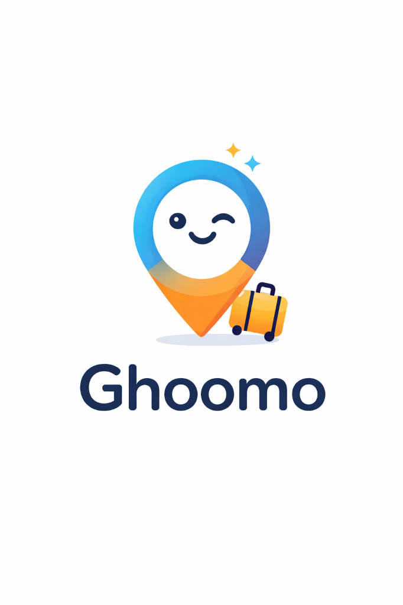

<div align="center">
  
  
  # Ghoomo - AI Travel Planner
  
  **Your Smart Companion for Global Adventures**

  [](https://flutter.dev)
  [](https://dart.dev)
  [](https://www.android.com)
  [](LICENSE)

  <p>
    <a href="#-features">Features</a> •
    <a href="#-screenshots">Screenshots</a> •
    <a href="#-installation">Installation</a> •
    <a href="#-tech-stack">Tech Stack</a>
  </p>
</div>

---

## 🚀 Overview

**Ghoomo** (meaning "Wander" in Hindi) is a premium, AI-powered travel planning application built with Flutter. It helps users discover, plan, and organize trips to **20+ global destinations**, featuring stunning AI-generated visuals, real-time currency tools, and personalized itineraries based on user personas.

## ✨ Features

- **🌍 20+ Global Destinations**: Explore detailed guides for Paris, Tokyo, Bali, and more, complete with offline-first AI imagery.
- **🤖 AI-Powered Itineraries**: Select your persona (Adventurer, Foodie, Luxury, etc.) and get a custom day-by-day travel plan.
- **📱 Premium UX/UI**: Liquid glass effects, parallax animations, and a sleek dark mode design.
- **💼 Trip Dashboard**: Save your plans, track budgets, and manage itineraries locally.
- **💱 Currency Tools**: Built-in support for major currencies with real-time conversion rates.
- **📶 Offline First**: Destinations and essential data are stored locally for access anywhere.

## 📸 Destinations

*Featuring 20 stunning destinations with custom AI art:*

| | | |
|:---:|:---:|:---:|
|  <br> **Tokyo** |  <br> **Paris** |  <br> **Dubai** |
|  <br> **Santorini** |  <br> **Rio** |  <br> **Bali** |

## 🛠 Tech Stack

- **Framework**: [Flutter](https://flutter.dev) (Dart)
- **State Management**: `setState` & `AnimationController` (Performance optimized)
- **Local Storage**: `SharedPreferences`
- **Network**: `http`
- **Assets**: Local asset caching with tree-shaken icons

## 📦 Installation

1. **Clone the repository**
   ```bash
   git clone https://github.com/Ashakk69/Ghoomo-Travel-AI.git
   cd Ghoomo-Travel-AI
   ```

2. **Install dependencies**
   ```bash
   flutter pub get
   ```

3. **Run the app**
   ```bash
   flutter run
   ```

4. **Build APK (Release)**
   ```bash
   flutter build apk --release
   ```

## 🎨 Branding

The **Ghoomo** brand represents curiosity and the joy of exploration.
- **Logo**: A friendly, winking location pin with a suitcase, symbolizing ready-to-go adventures.
- **Theme**: Deep dark backgrounds with vibrant accent colors (#4F46E5) and glassmorphism elements.

---

<div align="center">
  <sub>Built with ❤️ by the Ghoomo Team</sub>
</div>
